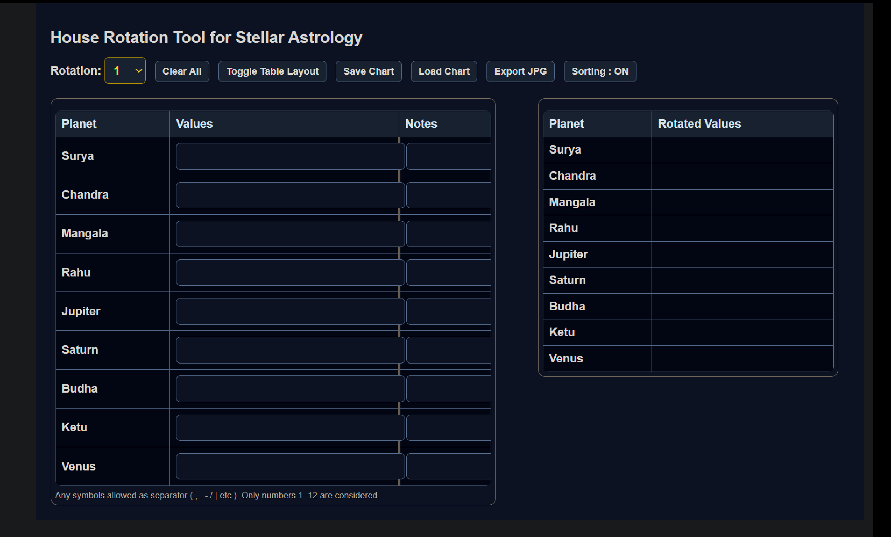

# 🧭 House Rotation Tool (Cyclic State Transformation)

🔗 Live Demo:  (https://donniedarsshan.github.io/house-rotation-tool/)

A browser-based analytical tool that demonstrates **cyclic transformations, state separation, validation, and persistence** using plain JavaScript.

> Although inspired by stellar astrology, this project is intentionally designed to showcase **core software engineering principles** used in real-world systems.

---

## 🎯 Problem Statement

In many analytical domains, values exist inside a **bounded cyclic range** (e.g., 1–12).
Rotating these values based on a reference point is a common requirement, but doing it manually is:

- Error-prone
- Repetitive
- Hard to verify

This tool solves that problem by providing a **deterministic, validated, and reproducible** rotation system.

---

## 🧠 Key Engineering Concepts Demonstrated

### 1️⃣ Cyclic Transformation Logic
- Implements bounded rotation within a fixed domain (1–12)
- Handles wrap-around safely without corrupting state
- Uses pure functions for predictable behavior

---

### 2️⃣ Source of Truth vs Derived State
- **Input Table** acts as the primary state
- **Output Table** is always derived from inputs
- Original data is never mutated

This mirrors state management patterns used in frontend frameworks and backend systems.

---

### 3️⃣ Defensive Input Validation
- Rejects invalid or out-of-range values early
- Prevents partial or inconsistent output states
- Ensures correctness before computation

---

### 4️⃣ State Persistence
- Supports saving the entire state as JSON
- Allows loading previously saved configurations
- Uses serialization patterns similar to APIs and config-driven systems

---

### 5️⃣ UX Safety & User Intent
- Confirmation before destructive actions
- Clear separation of editable vs computed data
- Layout toggling without DOM mutation hacks

---

## ✨ Features

- Bounded cyclic rotation (1–12)
- Multi-value input per entity
- Sorted derived output
- Notes support per entity
- Save chart as JSON
- Load previously saved charts
- Responsive table layout toggle
- Safe “Clear All” with confirmation

---

## ⚙️ Algorithm Overview

1. Parse user input into numeric arrays
2. Validate all values against domain constraints
3. Apply rotation offset
4. Normalize overflow values back into range
5. Sort results for deterministic output
6. Render output without mutating input state

**Time Complexity:** O(n) per entity  
**Space Complexity:** O(n) for derived values

---

## 🛠️ Tech Stack

- HTML5
- CSS3
- Vanilla JavaScript (No frameworks, no libraries)

---

## 📐 Design Decisions

- No external dependencies to keep logic transparent
- Pure functions for transformations
- CSS-based layout switching for simplicity
- Explicit user intent required for destructive actions

---

## 🔮 Future Enhancements

- Retrograde (reverse traversal) logic
- Degree-level precision support
- Export as PDF / image
- Undo / redo support
- Component-based refactor (React)

---

## 🧑‍💻 Author Notes

This project was built to practice **problem modeling, state management, and deterministic transformations** — skills directly transferable to production-grade frontend and backend systems.
